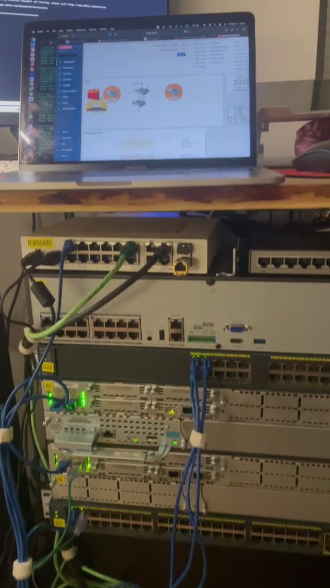

# Enterprise Network Engineering Lab

### Cisco Routing & Switching | Fortinet FortiGate | Network Redundancy | Monitoring

**Mykyta Mamaiev** · CCNA Certified · Harrison, New Jersey

A hands-on network engineering project built with **physical Cisco routers and switches**, a **Fortinet FortiGate 80E firewall**, and **Zabbix monitoring**. I designed this lab to practice enterprise-style network segmentation, routing, first-hop redundancy, network security, monitoring, and systematic troubleshooting on real hardware.

> **Project scope:** This is my independent home lab, not an employer production network. Implemented features are distinguished from proposed upgrades. The [architecture and validation notes](architecture-and-validation.md) identify design details that still need confirmation against running configurations.

## Physical Lab & Demonstration
## Network Topology

**[Watch the lab walkthrough (MP4)](lab-demo.mp4)**

## Infrastructure Overview

| Component | Implementation |
| --- | --- |
| Firewall / security | Fortinet FortiGate 80E |
| Routers | Cisco 2900-series (R1) and Cisco 2821 (R2) |
| Switches | Two physical Cisco switches (SW1 and SW2) |
| VLAN segmentation | Users (10), Voice (20), Servers (30), Cameras/NVR (40), Guests (50), IoT (60), Management (99) |
| Switching | 802.1Q trunks, STP, PortFast, BPDU Guard |
| Routing / redundancy | Static routes and VRRP between two Cisco routers |
| Firewall services | NAT, DHCP, segmentation and security policies |
| Observability | Zabbix, SNMPv2 polling and traps |
| Endpoint integration | Network video recorder (NVR) |

## Architecture & Engineering Work

**Layer 2 switching:** Configured VLANs and 802.1Q trunk connections, propagated VLANs across the switching topology, and applied STP-related edge protections.

**Layer 3 and resiliency:** Configured a VRRP virtual gateway (`10.99.99.254`) on two Cisco routers, with R1 configured at a higher priority than R2. Tested router role takeover by powering off R1. This validates **VRRP role failover**, not by itself uninterrupted connectivity for every client VLAN.

**Fortinet security:** Integrated a FortiGate 80E for routing toward the upstream network, NAT, DHCP, and firewall policy exercises.

**Monitoring:** Connected Cisco devices to Zabbix using SNMPv2 for interface and CPU monitoring, VRRP-state observation, and link-status events.

## Troubleshooting: Problems Solved

| Issue | Diagnosis | Corrective action |
| --- | --- | --- |
| VRRP-related traffic did not traverse the intended VLAN path | SW2 uplink configured as an access port instead of a trunk | Reconfigured uplink as a trunk and aligned native VLAN settings |
| SNMP targets were unreachable from Zabbix | Missing routed path from monitoring subnet | Corrected routing and verified SNMP connectivity with `snmpwalk` |
| R2 could not reach FortiGate | Firewall-side interface/address conflict | Reworked the connection using a VLAN-based firewall interface |

Read the full [troubleshooting case studies](troubleshooting.md).

## Validation Notes

The original project report contains some inconsistencies about **server subnet addressing** and the exact **FortiGate/VRRP gateway path**. These are documented in [Architecture & Validation](architecture-and-validation.md), rather than silently presented as a fully verified end-to-end design. A final topology diagram and claims about client traffic failover should be based on actual device configurations and connectivity tests.

## Next Iterations (Planned, Not Yet Implemented)

- OSPF dynamic routing
- VRFs and additional segmentation
- LACP / EtherChannel
- IPv6 dual-stack
- NetFlow / IPFIX
- FortiGate HA
- Automated configuration backups with Ansible

## Project Files

- [Architecture and validation](architecture-and-validation.md)
- [Troubleshooting case studies](troubleshooting.md)
- [Video walkthrough](lab-demo.mp4)
- [Equipment photo 1](lab-photo-1.jpg)
- [Equipment photo 2](lab-photo-2.jpg)

> **Security note:** Any configuration excerpts published in this repository should be sanitized to remove passwords, SNMP community strings, tokens, public addresses, and identifying management information. No employer-owned configurations or internal documentation should be posted.

---

**About me:** CCNA-certified IT infrastructure professional with experience supporting network-connected systems at The New School and collaborating with its Network Engineering team. Interested in Network Engineer I, Junior Network Engineer, and Network Infrastructure roles in the New York / New Jersey area.
